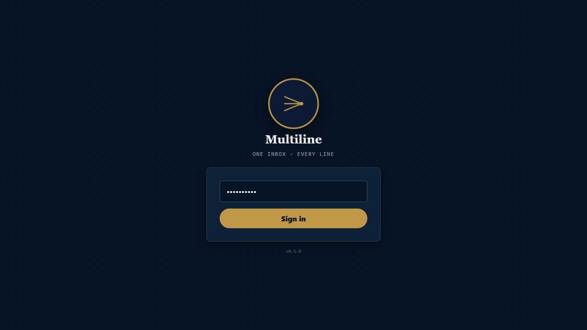
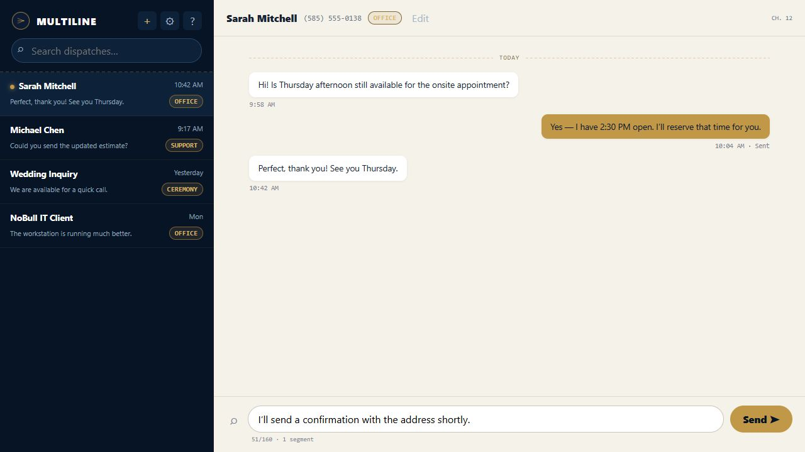
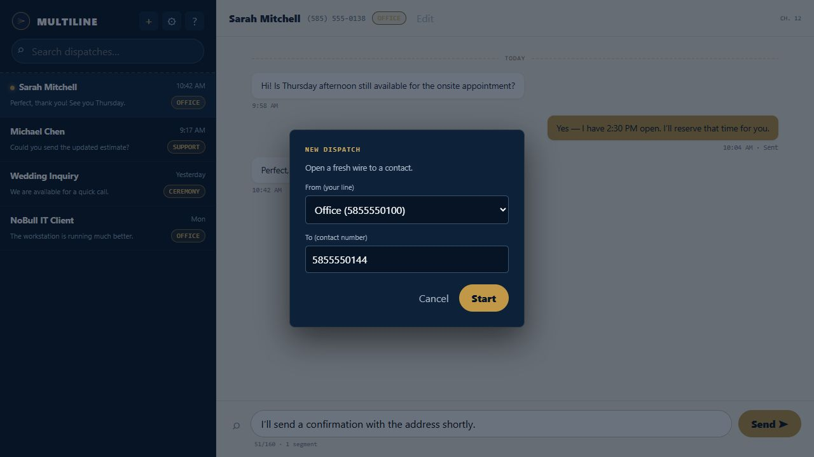
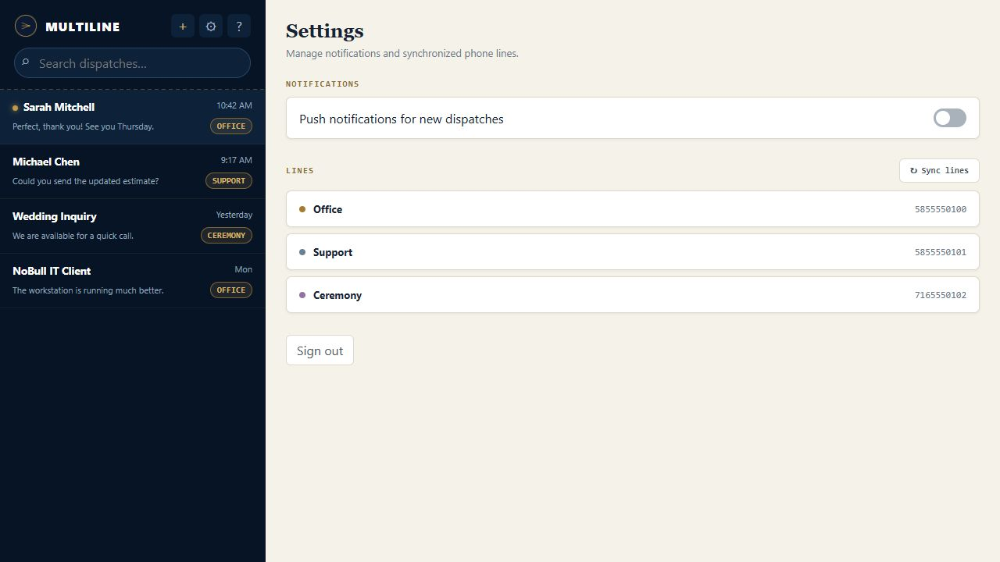
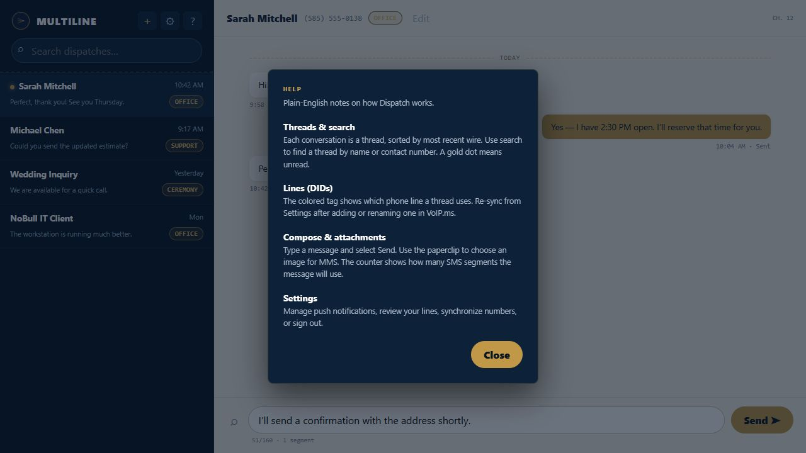

<p align="center">
  
</p>

<h1 align="center">DISPATCH <span style="font-weight:normal">— Multiline</span></h1>
<p align="center"><em>"One Line — Every Wire — No Bull"</em></p>

Dispatch is a self-hosted, single-user unified SMS/MMS inbox for people juggling multiple VoIP.ms phone numbers (DIDs) — personal, business, whatever — who want one place to read and send texts instead of switching numbers in the VoIP.ms portal.

Not a multi-tenant SaaS — this is built for one person to run for themselves, behind whatever access control (VPN, reverse-proxy auth, etc.) they choose to put in front of it.


> **Note:** The screenshots in this guide use fictional sample names, numbers, and messages. Your own lines and conversations will be different.

## Contents

- [Features](#features)
- [Stack](#stack)
- [Setup](#setup)
- [Run (dev)](#run-dev)
- [Build](#build)
- [Deploy](#deploy)
- [Using Dispatch](#using-dispatch)
  - [Sign in](#sign-in)
  - [Understand the inbox](#understand-the-inbox)
  - [Find a conversation](#find-a-conversation)
  - [Start a new conversation](#start-a-new-conversation)
  - [Read and send messages](#read-and-send-messages)
  - [Send an image by MMS](#send-an-image-by-mms)
  - [Rename a contact](#rename-a-contact)
  - [Delete or retry a message](#delete-or-retry-a-message)
  - [Manage lines and notifications](#manage-lines-and-notifications)
  - [Install the app](#install-the-app)
  - [Built-in help](#built-in-help)
  - [Sign out](#sign-out)
- [Troubleshooting](#troubleshooting)
- [License](#license)

## Features

- **Unified inbox** across every SMS/MMS-capable DID on your VoIP.ms account, synced automatically from your account (no manual DID entry).
- **Send and receive SMS and MMS** — attach an image via a real file picker, not a pasted URL.
- **Live updates over WebSocket** — new messages and status changes show up without a refresh.
- **Installable PWA** with Web Push notifications and an app-icon unread badge.
- **Per-message delete** (local + best-effort delete on VoIP.ms's side).
- **Reconciliation poll** that backfills messages sent from the VoIP.ms portal directly, or lost to a missed webhook delivery.
- **Desk-phone notify (optional)** — notify a UCM-style PBX extension by SIP MESSAGE (via AMI) when a text arrives on a given line, if you also have a desk phone on it.
- **Login rate limiting**, GSM-7/Unicode-aware segment counter on compose, responsive mobile layout.

## Stack

| | |
|---|---|
| **Backend** — `backend/` | Fastify + TypeScript, Node's built-in `node:sqlite` for storage, a VoIP.ms REST API client, WebSocket for live updates. |
| **Frontend** — `frontend/` | React + Vite + TypeScript, Tailwind CSS, installable PWA (`vite-plugin-pwa`). |

Not an npm-workspaces monorepo — `backend/` and `frontend/` each install and run independently. (Workspaces need symlinks in `node_modules`, which can fail on some network-mounted checkouts; running each sub-project standalone sidesteps that.)

## Setup

```bash
npm run install:all
```

Then copy `backend/.env.example` to `backend/.env` and fill in:

| Variable | Notes |
|---|---|
| `APP_PASSWORD_HASH` | Bcrypt hash for the single-user login password. Generate with: `node -e "console.log(require('bcryptjs').hashSync('yourpassword', 10))"` |
| `SESSION_SECRET` | Any random string, 32+ characters. |
| `VOIPMS_API_USERNAME` / `VOIPMS_API_PASSWORD` | From the VoIP.ms portal (Account → API Control). |
| `VOIPMS_WEBHOOK_SECRET` | Any random string; appended as a query param (`?secret=...`) on the callback URL you register in the VoIP.ms portal for inbound SMS/MMS. VoIP.ms's actual webhook body doesn't match their documented flat format — the secret is a query param, not a body field, and the real body shape is `{ data: { payload: {...} } }`. See `backend/src/webhooks/sms.ts` for details, and check your own server logs for a "Rejected inbound SMS webhook payload" warning if deliveries aren't showing up. |

Everything else in `.env.example` (uploads, push, AMI desk-phone notify) is optional and disabled until configured.

DIDs sync from VoIP.ms automatically: Settings page → "Sync lines", or `POST /api/dids/sync`. Start a new conversation from the "+" button in the thread list (picks a DID + contact number).

> **DID labels come from the VoIP.ms "Note" field**, not "Description" — Description is VoIP.ms-assigned (e.g. a rate-center code) and can't be edited from the portal, but Note can. To control what a DID shows as in Dispatch, edit its Note under VoIP.ms portal → Main Menu → DID Numbers → Manage DIDs → (select DID). If Note is empty, the label falls back to Description, then to the bare DID number.

## Run (dev)

```bash
npm run dev:backend    # http://localhost:3001
npm run dev:frontend   # http://localhost:5173, proxies /api and /ws to the backend
```

## Build

```bash
npm run build
```

## Deploy

Multi-stage `Dockerfile` at the repo root builds the frontend and backend into a single `node:24-alpine` image; the backend serves the built frontend statically. Binds `0.0.0.0`; `DB_PATH` and `UPLOADS_DIR` both default under `/app/data`, declared as a `VOLUME` — bind-mount it so your data survives rebuilds.

docker-compose / actual deployment config is intentionally not in this repo, since that's specific to wherever you host it.

---

## Using Dispatch

Everything below is written for the person actually using the app day to day, once it's installed and running.

### Sign in

Open the Dispatch address supplied by the person who installed the application.



1. Enter your Dispatch password.
2. Select **Sign in**.

The Dispatch password is separate from your VoIP.ms account password. Repeated incorrect attempts are temporarily rate-limited. If you see **Too many failed attempts**, wait a few minutes before trying again.

### Understand the inbox

After signing in, Dispatch displays the conversation list on the left and the selected conversation on the right.



The conversation list shows:

- The saved contact name, or the contact's phone number when no name has been assigned.
- A preview of the most recent message.
- The time or date of the most recent activity.
- A colored line tag identifying the VoIP.ms DID used for that conversation.
- A gold dot for unread conversations.

Conversations are ordered with the most recently active conversation first. New inbound messages and message-status changes appear automatically without refreshing the page.

On a phone or narrow screen, Dispatch shows either the conversation list or the open conversation. Use the back arrow at the top of a conversation to return to the list.

### Find a conversation

Use **Search dispatches…** above the conversation list. You can search by:

- Contact name
- Contact phone number
- Line label

The list filters as you type. Clear the search field to display every conversation again.

### Start a new conversation

Select the **+** button in the upper-right corner of the conversation list.



1. Under **From (your line)**, choose the VoIP.ms phone number that should send and receive messages for this conversation.
2. Under **To (contact number)**, enter the recipient's telephone number.
3. Select **Start**.

Dispatch opens the new conversation. Enter a message in the compose area and select **Send**.

If the line you need is missing, open **Settings** and select **Sync lines**. If synchronization still does not show it, confirm that the DID is SMS/MMS-capable in VoIP.ms.

### Read and send messages

Select a conversation from the list to open it. Incoming messages appear on the left in white; outgoing messages appear on the right in gold. Day dividers separate messages from different dates.

To send a text message:

1. Enter the message in **Wire your message…**.
2. Review the segment counter below the field.
3. Select **Send**.

The counter shows the number of characters used, the per-segment limit, and the estimated number of SMS segments. Messages containing characters outside the GSM-7 character set are marked **Unicode** and may use shorter segment limits.

An outgoing message initially displays **Sending…** and then changes to **Sent** when the request succeeds.

### Send an image by MMS

1. Open or create a conversation.
2. Select the paperclip beside the message field.
3. Choose a JPEG, PNG, GIF, or WebP image from your device.
4. Wait for the attachment preview to appear.
5. Optionally enter accompanying text.
6. Select **Send**.

Select **Remove** beside the preview if you chose the wrong file. Do not close the page while an attachment displays **Uploading…**.

### Rename a contact

VoIP.ms SMS webhooks do not include caller-name information, so contact names are stored locally in Dispatch.

1. Open the conversation.
2. Select **Edit** beside the contact information at the top.
3. Enter the desired display name.
4. Select **Save**.

Clear the name and save to return to displaying the phone number.

### Delete or retry a message

#### Delete a message

On a desktop browser, move the pointer over a message to reveal its delete control. Select it, then select **Confirm delete**. Select **Cancel** to keep the message.

Deletion removes the local copy and makes a best-effort request to delete the corresponding message from VoIP.ms. A remote copy may remain if VoIP.ms cannot complete that request.

#### Retry a failed message

If an outgoing message displays **Failed to send**:

1. Confirm that the server has internet access and that the VoIP.ms API is available.
2. Select **Retry** below the failed message.

If retrying continues to fail, contact the person who administers the Dispatch server.

### Manage lines and notifications

Select the gear button above the conversation list to open **Settings**.



#### Synchronize phone lines

Select **Sync lines** to retrieve the current SMS/MMS-capable DIDs from VoIP.ms. Use this after adding a DID or changing its label.

Dispatch uses the VoIP.ms **Note** field as the preferred line label. If Note is empty, it uses the VoIP.ms Description and then the bare DID number. To change a label, update the DID's Note in the VoIP.ms portal and synchronize the lines again.

#### Push notifications

Use the notification switch to enable or disable notifications for new inbound messages. When enabling notifications, allow the browser's notification request.

The notification option may be unavailable when:

- The browser does not support web push.
- The server administrator has not configured VAPID push keys.
- The site is not being served through a secure HTTPS connection, except during local testing.

Supported installed versions of the app can also show the unread count on the application icon.

### Install the app

Dispatch is a Progressive Web App (PWA). A supported browser may offer **Install app**, **Add to Home Screen**, or a similar command in its address bar or menu.

Installing Dispatch provides an app-like window and may improve access to notifications and icon badges. Installation does not make messaging work offline; the Dispatch server and VoIP.ms still need to be reachable.

### Built-in help

Select the **?** button above the conversation list to open the built-in help panel.



The panel summarizes conversation search, line tags, attachments, segment counts, and settings.

### Sign out

1. Open **Settings**.
2. Select **Sign out**.

You are returned to the sign-in screen. Sign out when using a shared or unattended device.

## Troubleshooting

### The application cannot reach the server

- Confirm that the device can reach the Dispatch address.
- Check the network, VPN, or reverse-proxy connection used by your installation.
- Refresh the page and sign in again.
- If the problem continues, contact the server administrator.

### A new inbound message does not appear

- Wait briefly for the reconciliation process to retrieve missed messages.
- Confirm that the conversation is not hidden by a search filter.
- Ask the administrator to verify the VoIP.ms callback URL and webhook secret.
- The administrator can check the server log for rejected webhook payload warnings.

### A line is missing or has the wrong label

- Open **Settings** and select **Sync lines**.
- Confirm that the DID supports SMS/MMS in VoIP.ms.
- Update the DID's **Note** field in VoIP.ms, then synchronize again.

### Notifications do not appear

- Confirm that notifications are enabled in Dispatch Settings.
- Confirm that the browser or operating system has not blocked notifications for the site.
- Confirm that the application is served securely over HTTPS.
- Ask the administrator whether push-notification keys are configured.

### A message remains in "Sending…" or fails

- Check the network connection.
- Wait briefly, then use **Retry** if it appears.
- Avoid repeatedly selecting Send, because the original request may still be processing.
- Ask the administrator to confirm the VoIP.ms API credentials and service status.

## License

MIT — see [LICENSE](./LICENSE).

---

Dispatch version 0.1.0 · NoBull IT Solutions
